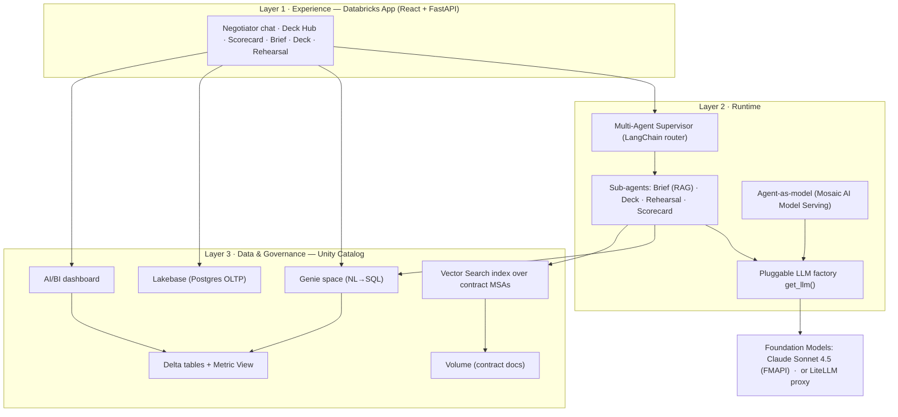

# COGS Negotiation Agent — How It Works (End to End)

A Databricks-native, agentic application that helps **Kroger category negotiators**
prepare for and run supplier COGS (cost-of-goods-sold) negotiations across the
beverage category (PepsiCo, Coca-Cola, Keurig Dr Pepper).

It is built entirely on real Databricks primitives — Unity Catalog, Metric Views,
Genie, Vector Search, Mosaic AI Model Serving, Lakebase, AI/BI dashboards, and a
Databricks App — with a **pluggable LLM layer** (Mosaic AI Gateway ↔ LiteLLM).

---

## 1. What it does

A negotiator can:

| Capability | What it produces | Powered by |
|---|---|---|
| **Negotiator (AI)** | Ask anything in plain English; it routes to the right tool | Multi-Agent Supervisor |
| **Supplier Scorecard** | Live metrics table + conversational Q&A + an AI/BI dashboard | Genie + AI/BI |
| **Negotiation Brief** | Board-ready talking points grounded in the supplier's contract | Knowledge Assistant (RAG) |
| **Fact-Pack Deck** | A data-driven negotiation deck (KPIs, narrative, asks) | Deck builder (LLM) |
| **Rehearsal Room** | Role-play practice against the supplier's account manager | Vendor Rehearsal agent |

---

## 2. Architecture (three layers)



- **Layer 1 — Experience:** the Databricks App users interact with.
- **Layer 2 — Runtime:** the agent brains — a supervisor that routes to sub-agents,
  all calling the pluggable LLM factory; also packaged as a served model.
- **Layer 3 — Data & Governance:** everything in Unity Catalog — the single
  governance boundary.

---

## 3. Repository layout

```
cogs-negotiation-agent/
├── app.py                     # FastAPI entry — mounts API + serves the React SPA; opens Lakebase pool
├── app.yaml                   # Databricks App config + all env vars (LLM_PROVIDER, GENIE_SPACE_ID, …)
├── pyproject.toml / uv.lock   # Python deps (app runtime)
├── agent_model.py             # The agent packaged as an MLflow ChatAgent (for serving)
├── deploy_agent.py            # Log → register (UC) → deploy the served model
├── data_foundation.py         # Builds Delta tables + Metric View
├── build_genie.py             # Authors the Genie space
├── build_knowledge.py         # Builds contract Volume + chunks + Vector Search index
├── build_dashboard.py         # Builds/updates + publishes the AI/BI dashboard
├── server/
│   ├── config.py              # Dual/triple-mode auth (local CLI / App SP / model-serving)
│   ├── llm.py                 # ★ Pluggable LLM factory — get_llm(), Mosaic ↔ LiteLLM
│   ├── data.py                # Synthetic source-of-truth data (mirrored into UC)
│   ├── agents.py              # Brief (RAG) / Deck / Rehearsal LangChain chains
│   ├── supervisor.py          # Multi-Agent Supervisor (LLM router)
│   ├── genie.py               # Genie Conversation API client
│   ├── knowledge.py           # Vector Search retrieval (RAG)
│   ├── state.py               # Lakebase (Postgres) persistence + in-memory fallback
│   └── routes/                # FastAPI routers: catalog, agentic, genie_routes, supervisor_routes
└── frontend/                  # React + Vite + TS + Tailwind
    └── src/pages/             # Hub, Negotiator, Scorecard, Brief, Deck, Rehearsal
```

---

## 4. Component-by-component

### 4.1 The pluggable LLM factory — `server/llm.py` ★

The heart of the design. Every chain/agent calls `get_llm()` and receives a
LangChain `BaseChatModel`; **none of them know which provider is live.**

- `LLM_PROVIDER=mosaic` (default) → `ChatOpenAI` pointed at the **governed
  Databricks path**. On this Azure workspace the dedicated `ai-gateway.*`
  subdomain isn't available, so it falls back to the workspace
  `/serving-endpoints` OpenAI-compatible route (usage still records in
  `system.serving.endpoint_usage`; Gateway config attaches at the endpoint).
- `LLM_PROVIDER=litellm` → the same `ChatOpenAI` pointed at a **LiteLLM proxy**
  (`LITELLM_BASE_URL`). LiteLLM can route upstream *through* Mosaic to keep one
  governance boundary, or go direct.
- Both providers are OpenAI wire-compatible, so the switch is **one env var, zero
  code change**. A third `databricks` mode (native `ChatDatabricks`) exists behind
  a flag.

Switching is config-only — change `LLM_PROVIDER` in `app.yaml` (app) or the
serving endpoint env (served model) and redeploy.

### 4.2 Auth — `server/config.py`

Detects the runtime and authenticates accordingly:
- **Local dev** → Databricks CLI profile (`DATABRICKS_PROFILE`).
- **Databricks App** → auto-injected service-principal credentials.
- **Model serving** → automatic-auth identity (scoped to declared resources).

### 4.3 Data foundation (Layer 3) — `data_foundation.py` → `kroger_demo.cogs`

- **`supplier_scorecard`** (Delta) — one row per supplier with spend, COGS/unit,
  landed-cost index, YoY changes, trade funds, fill rate, OTIF, rebate tier,
  contract expiry.
- **`regional_performance`** (Delta) — dollar sales, YoY, units, store counts by
  US Census division.
- **`landed_cost_metrics`** (**Metric View**) — the *certified* definitions of
  Total Spend, Avg COGS/Unit, Blended Landed Cost Index, Blended COGS Inflation,
  etc. Queried with `MEASURE(...)`. This is the single source of truth that Genie
  and the dashboard agree on.

> The numbers originate in `server/data.py` so the app and UC stay in sync; in a
> real deployment these tables come from ingestion + a certified metric layer.

### 4.4 Genie space — `build_genie.py`

A Genie space (`id 01f1642219cf135cb84f7e0dbc8d6957`) over the metric view +
tables, with instructions encoding the domain rules (use `MEASURE()`,
landed-cost-index baseline = 100, positive YoY = cost inflation), example SQL,
and benchmark questions. Turns plain-English questions into governed SQL.

### 4.5 Knowledge Assistant (RAG) — `build_knowledge.py` + `server/knowledge.py`

- Per-supplier **Master Supply Agreements** (6 clauses each: Pricing, COGS
  Adjustment, Rebates, Trade Funds, Service Levels, Term/Termination) written to a
  UC **Volume** `/Volumes/kroger_demo/cogs/contracts/`.
- Clause-level **chunks** in Delta `contract_chunks` (Change Data Feed on).
- A **Delta-Sync Vector Search index** `contract_chunks_index` with **managed
  embeddings** (`databricks-gte-large-en`) on the existing `kroger-recipe-search`
  endpoint.
- `knowledge.retrieve()` pulls the top-k clauses *filtered to the supplier*; the
  Brief agent injects them and **cites the section names**.

### 4.6 Sub-agents — `server/agents.py`

LangChain chains, all on `get_llm()`:
- **`build_negotiation_brief`** — RAG-grounded brief (retrieves contract clauses →
  prompt → brief that cites clauses + numbers).
- **`build_fact_pack`** — returns a structured JSON deck (title, hypothesis, KPIs,
  sections, asks) the React deck viewer renders.
- **`rehearse_turn`** — role-plays the supplier's key account manager, in character.

### 4.7 Multi-Agent Supervisor — `server/supervisor.py`

A pure-LangChain LLM **router** (no LangGraph). Given any message it classifies
intent → `{scorecard, brief, deck, rehearse, chat}` and extracts the supplier,
then dispatches:
- `scorecard`/`chat` → **Genie**
- `brief` → RAG brief · `deck` → deck builder · `rehearse` → rehearsal agent

Returns a unified envelope the UI renders by `route` (text / table+SQL / deck).

### 4.8 Agent-as-model — `agent_model.py` + `deploy_agent.py`

The same logic packaged as an **MLflow `ChatAgent`**, registered in Unity Catalog
(`kroger_demo.models.cogs_negotiation_agent`) and deployed to a **Mosaic AI Model
Serving** endpoint (`agents_kroger_demo-models-cogs_negotiation_agent`). This gives
the agent its own queryable REST endpoint, inference tables, evaluation, and
monitoring.

- Driven by `custom_inputs.task` = `brief | deck | rehearse | chat`.
- Declares the FM endpoint, embedding endpoint, Vector Search index, Genie space,
  and SQL warehouse as **serving resources** (automatic auth).
- **The LLM switch is preserved** here too — set `LLM_PROVIDER` as the endpoint env.
- **Design note:** the served model is **self-contained** — `brief` (RAG), `deck`,
  `rehearse`, and a grounded `chat` over bundled facts. Genie-backed NL→SQL routing
  lives in the **app**, because a served model runs Genie under an automatic-auth
  identity that can't execute the downstream SQL.

### 4.9 Lakebase persistence — `server/state.py`

Saved briefs/decks/rehearsals + the work queue persist to **Lakebase (Postgres
OLTP)** instance `cogs-lakebase`, table `agent_artifacts(id, kind, supplier_key,
payload jsonb, created_at)`. Tokens are minted fresh per connection via
`w.database.generate_database_credential(...)` (no background refresh). If Lakebase
isn't attached, it falls back to an in-memory store so the app still runs.

### 4.10 AI/BI dashboard — `build_dashboard.py`

A published **Lakeview dashboard** (`id 01f1643845191b049c9a3acf7531495b`) over
`kroger_demo.cogs`: KPI counters, supplier comparison bars, regional bars, a detail
table, and a **global-filters page** (Supplier / Rebate Tier / Region). It's
**embedded** in the Scorecard page via iframe (workspace embedding policy set to
`ALLOW_APPROVED_DOMAINS` for the app's domain) with an "open full dashboard" link.

### 4.11 The app — `app.py`, `server/routes/`, `frontend/`

- **Backend** (FastAPI): serves `/api/*` and the built React SPA. Routers:
  `catalog` (hub/scorecard/overview/health), `agentic` (brief/deck/rehearse +
  saved artifacts), `genie_routes` (ask/scorecard/dashboard), `supervisor_routes`
  (the router). The lifespan opens/closes the Lakebase pool.
- **Frontend** (React + Tailwind, dark teal/orange theme): **Deck Hub** (supplier
  gallery), **Negotiator** (supervisor chat), **Scorecard** (Genie table + Ask +
  embedded AI/BI dashboard), **Brief** (with clause-citation chips), **Deck**,
  **Rehearsal**. The sidebar shows a live **LLM-routing badge**.

---

## 5. End-to-end request flows

**A negotiator asks the Negotiator: "draft a brief for Pepsi to claw back COGS"**
```
Browser → /api/supervisor/ask
  → supervisor classifies: route=brief, supplier=pepsi
  → agents.build_negotiation_brief(pepsi, objective)
      → knowledge.retrieve(...)  → Vector Search index → top contract clauses
      → ChatPromptTemplate | get_llm()  → Claude (Mosaic) → grounded brief
  → state.save_artifact("briefs", …)  → Lakebase
  → returns {route:"brief", answer, sources} → UI renders brief + clause chips
```

**The Scorecard table loads**
```
Browser → /api/genie/scorecard
  → genie.ask(fixed question)  → Genie Conversation API
      → Genie writes SQL over kroger_demo.cogs → runs on the warehouse
  → returns {text, sql, columns, rows} → UI renders table + "Show SQL"
```

**Someone queries the served model directly**
```
POST /serving-endpoints/agents_…/invocations
  {messages, custom_inputs:{task:"brief", supplier_key:"kdp"}}
  → ChatAgent.predict → build_negotiation_brief → Vector Search + get_llm() → brief
  → inference tables capture the request/response
```

---

## 6. Deploy & run

### Prerequisites
- Databricks CLI authenticated to the workspace (profile `cogs-demo`)
- `uv` (Python) and `node`/`npm` (frontend)
- Serverless workspace (for Lakebase + Apps)

### One-time data/AI build (workspace-side)
```bash
DATABRICKS_CONFIG_PROFILE=cogs-demo python data_foundation.py     # Delta + Metric View
DATABRICKS_CONFIG_PROFILE=cogs-demo python build_genie.py         # Genie space
DATABRICKS_CONFIG_PROFILE=cogs-demo python build_knowledge.py     # Volume + Vector Search
DATABRICKS_CONFIG_PROFILE=cogs-demo python build_dashboard.py     # AI/BI dashboard
```

### The app
```bash
# build frontend
cd frontend && npm install && npm run build && cd ..
# lock deps
uv lock --native-tls
# sync + deploy
databricks sync . /Users/<you>/cogs-negotiation-agent --exclude node_modules --exclude .venv -p cogs-demo
databricks apps deploy cogs-negotiation-agent \
  --source-code-path /Workspace/Users/<you>/cogs-negotiation-agent -p cogs-demo
```
Attach resources (UI or CLI): the **LLM serving endpoint** (`CAN_QUERY`) and the
**Lakebase database** (`CAN_CONNECT_AND_CREATE`).

### The served model
```bash
# needs extra local tooling (not app runtime deps):
uv pip install mlflow databricks-agents azure-storage-file-datalake azure-storage-blob azure-identity
DATABRICKS_CONFIG_PROFILE=cogs-demo python deploy_agent.py
```

### Local dev
```bash
export DATABRICKS_PROFILE=cogs-demo
uv run uvicorn app:app --reload --port 8000      # backend
cd frontend && npm run dev                        # frontend (proxies /api → :8000)
```

---

## 7. Switching the LLM provider (Mosaic ↔ LiteLLM)

In `app.yaml` (app) or the serving endpoint env (served model):
```yaml
# Mosaic (default, governed)
LLM_PROVIDER: mosaic
LLM_MODEL:    databricks-claude-sonnet-4-5

# LiteLLM
LLM_PROVIDER: litellm
LITELLM_BASE_URL: http://<litellm-proxy>:4000
LITELLM_API_KEY:  {{secrets/<scope>/<key>}}
LITELLM_MODEL:    claude-sonnet-4
LITELLM_ROUTES_VIA_MOSAIC: "true"   # keep one governance boundary
```
Then redeploy. No agent code changes.

---

## 8. Design decisions & known limitations

- **Synthetic-but-real data.** Numbers originate in `server/data.py` and are
  materialized as real Delta tables; swap ingestion + a certified metric layer for
  production.
- **Served model is Genie-free** (self-contained); the app handles Genie NL→SQL
  where the app SP has working data access.
- **Regional viz uses bars, not a choropleth** — the data is by Census division,
  not US states/countries (a choropleth needs standard region keys).
- **"Avg COGS Inflation"** on the dashboard is a simple average (filter-friendly);
  the spend-weighted "blended" figure lives in the metric view for exact reporting.
- **Embedding** is enabled with a least-privilege workspace policy
  (`ALLOW_APPROVED_DOMAINS`, only the app's domain).

---

## 9. Resource inventory

| Resource | Identifier |
|---|---|
| Workspace | `adb-7405614449041750.10.azuredatabricks.net` (Azure) · CLI profile `cogs-demo` |
| App URL | `https://cogs-negotiation-agent-7405614449041750.10.azure.databricksapps.com` |
| App service principal | `a432c266-0858-4f97-aa29-4c726a30c0eb` |
| Catalog / schema | `kroger_demo.cogs` |
| Delta tables | `supplier_scorecard`, `regional_performance`, `contract_chunks` |
| Metric View | `kroger_demo.cogs.landed_cost_metrics` |
| Volume | `/Volumes/kroger_demo/cogs/contracts/` |
| Genie space | `01f1642219cf135cb84f7e0dbc8d6957` |
| Vector Search index | `kroger_demo.cogs.contract_chunks_index` (endpoint `kroger-recipe-search`, embeddings `databricks-gte-large-en`) |
| Registered model | `kroger_demo.models.cogs_negotiation_agent` |
| Agent serving endpoint | `agents_kroger_demo-models-cogs_negotiation_agent` |
| Foundation model | `databricks-claude-sonnet-4-5` |
| Lakebase instance | `cogs-lakebase` (`ep-blue-pine-e121z0sk.database.eastus2.azuredatabricks.net`) |
| AI/BI dashboard | `01f1643845191b049c9a3acf7531495b` |
| SQL warehouse | `a455a68035c1f578` (Serverless Starter) |
